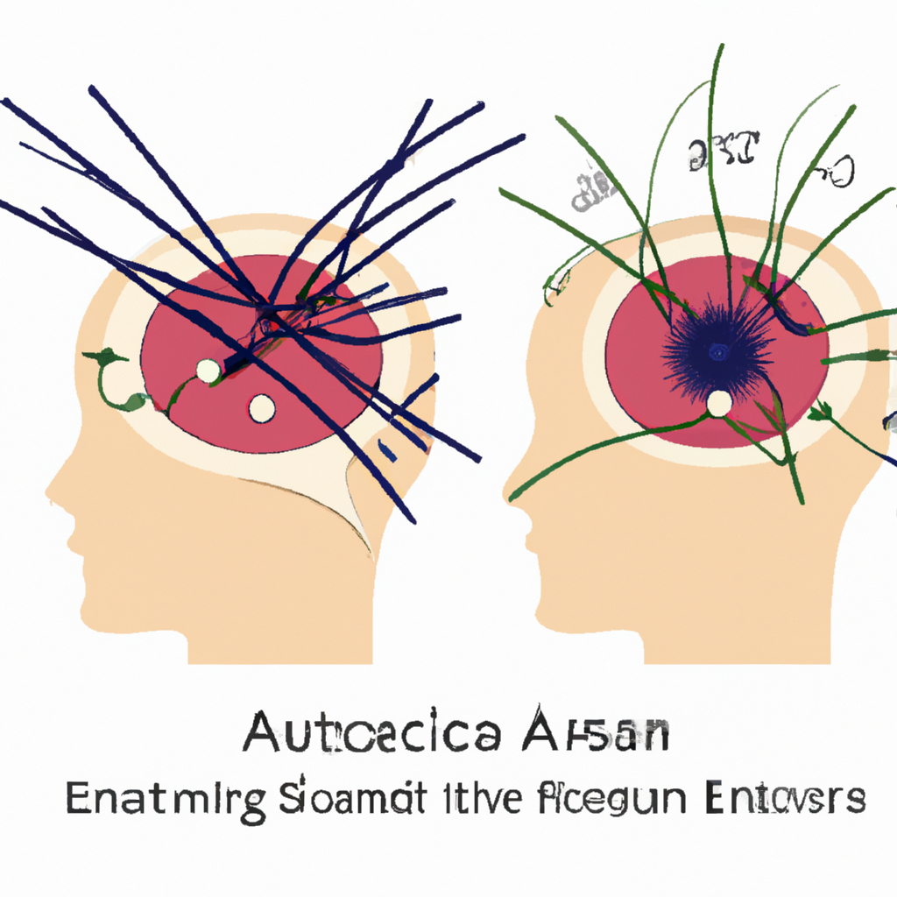

# The potential associations between acupuncture sensation and brain functional network: a EEG study.

**Yazarlar:** Dongyang Shen, Banghua Yang, Jing Li, Jiayang Zhang, Yongcong Li, Guofu Zhang, Yanyan Zheng

## 🧬 Özet (Makale)
Acupuncture has been widely used as an effective treatment for post-stroke rehabilitation. However, the potential association between acupuncture sensation, an important factor influencing treatment efficacy, and brain functional network is unclear. This research sought to reveal and quantify the changes in brain functional network associated with acupuncture sensation. So multi-channel EEG signals were collected from 30 healthy participants and the Massachusetts General Hospital Acupuncture Sensation Scale (MASS) was utilized to assess their needling sensations. Phase Lag Index (PLI) was used to construct the brain functional network, which was analyzed with graph theoretic methods. It showed that in the needle insertion (NI) state the MASS Index was significantly higher than in the needle retention (NR) state (

## ✨ GPT Destekli Özet
**Türkçe:**

Akupunktur, inme sonrası rehabilitasyon için etkili bir tedavi olarak yaygın şekilde kullanılmaktadır. Ancak, tedavi etkinliğini etkileyen önemli bir faktör olan akupunktur hissinin, beyin fonksiyonel ağı ile potansiyel ilişkisi belirsizdir. Bu araştırma, akupunktur hissi ile ilişkili beyin fonksiyonel ağındaki değişiklikleri ortaya çıkarmayı ve niceliklendirmeyi amaçlamaktadır. Bu nedenle, 30 sağlıklı katılımcıdan çok kanallı EEG sinyalleri toplandı ve iğneleme hislerini değerlendirmek için Massachusetts Genel Hastanesi Akupunktur Hissi Ölçeği (MASS) kullanıldı. Beyin fonksiyonel ağının oluşturulması için Faz Gecikme İndeksi (PLI) kullanıldı ve grafik teorik yöntemlerle analiz edildi. Iğne takılma (NI) durumunda MASS İndeksinin, iğne bekletme (NR) durumuna göre anlamlı olarak daha yüksek olduğunu gösterdi.

**English:**

Acupuncture is commonly employed as an effective treatment for post-stroke rehabilitation. Yet, the potential link between acupuncture sensation, a significant factor influencing treatment efficacy, and the brain functional network remains unclear. This study aimed to expose and quantify the alterations in the brain functional network associated with acupuncture sensation. Consequently, multi-channel EEG signals were collected from 30 healthy subjects, and the Massachusetts General Hospital Acupuncture Sensation Scale (MASS) was used to evaluate their needling sensations. The Phase Lag Index (PLI) was utilized to construct the brain functional network, which was analysed with graph theoretical methods. The study revealed that in the needle insertion (NI) state, the MASS Index was significantly higher compared to the needle retention (NR) state.

## 🧠 Bilimsel Yorum
**Türkçe:**

Türkçe Yorum:

Geleneksel Çin Tıbbı (GCT) bakış açısından, bu çalışma farklı akupunktur uygulama aşamalarından kaynaklanan beyin işlevsel ağındaki değişiklikleri ortaya çıkarırken, akupunkturun nörolojik etkisini daha iyi anlamamıza yardımcı olabilir. Çalışmada, iğne takılan bireylerin duyularının ölçümü için Massachusetts Genel Hastanesi Akupunktur Duyusu Ölçeği (MASS) kullanılmış bununla birlikte, manyetoelektroensefalografi (EEG) verilerini analiz etmek için Faz Gecikme İndeksi (PLI) kullanılmıştır. Methodolojik olarak, EEG kullanımı beyinde akupunktur etkisinin nesnel bir değerlendirmesini sağlamaktadır. Ancak, bu çalışmanın sadece sağlıklı katılımcılardan oluşan bir örneklem üzerinde yürütüldüğünü belirtmek önemlidir. Bu nedenle, bulguların felç sonrası rehabilitasyonu olan hastalar üzerindeki etkisi konusunda daha fazla araştırma gereklidir. Bu bulgular doğrultusunda klinik potansiyel, akupunktur uygulaması ve beyin fonksiyonlarındaki değişiklikler arasındaki ilişkinin daha iyi anlaşılmasıdır.

English Comment:

From a Traditional Chinese Medicine (TCM) perspective, this study could help us better understand the neurological impact of acupuncture by unveiling changes in the brain functional network arising from different stages of acupuncture application. The research employed the Massachusetts General Hospital Acupuncture Sensation Scale (MASS) to measure the sensations of individuals undergoing needling and the Phase Lag Index (PLI) to analyze magnetoencephalography (EEG) data. Methodologically, the use of EEG provides for an objective assessment of the effect of acupuncture in the brain. However, it's important to note that this study was conducted on a sample consisting only of healthy participants. Thus, further research is needed regarding the impact of these findings on patients undergoing post-stroke rehabilitation. Clinically, the potential lies in better understanding the relationship between the application of acupuncture and changes in brain functions.

**English:**

## 🖼️ İlgili Görsel

## 🔗 Kaynak
[PubMed'de Görüntüle](https://pubmed.ncbi.nlm.nih.gov/40099217/)

## 🗂️ Kategoriler
`Bilimsel Araştırmalar`, `Mekanizma & Teori`, `Teknikler`

