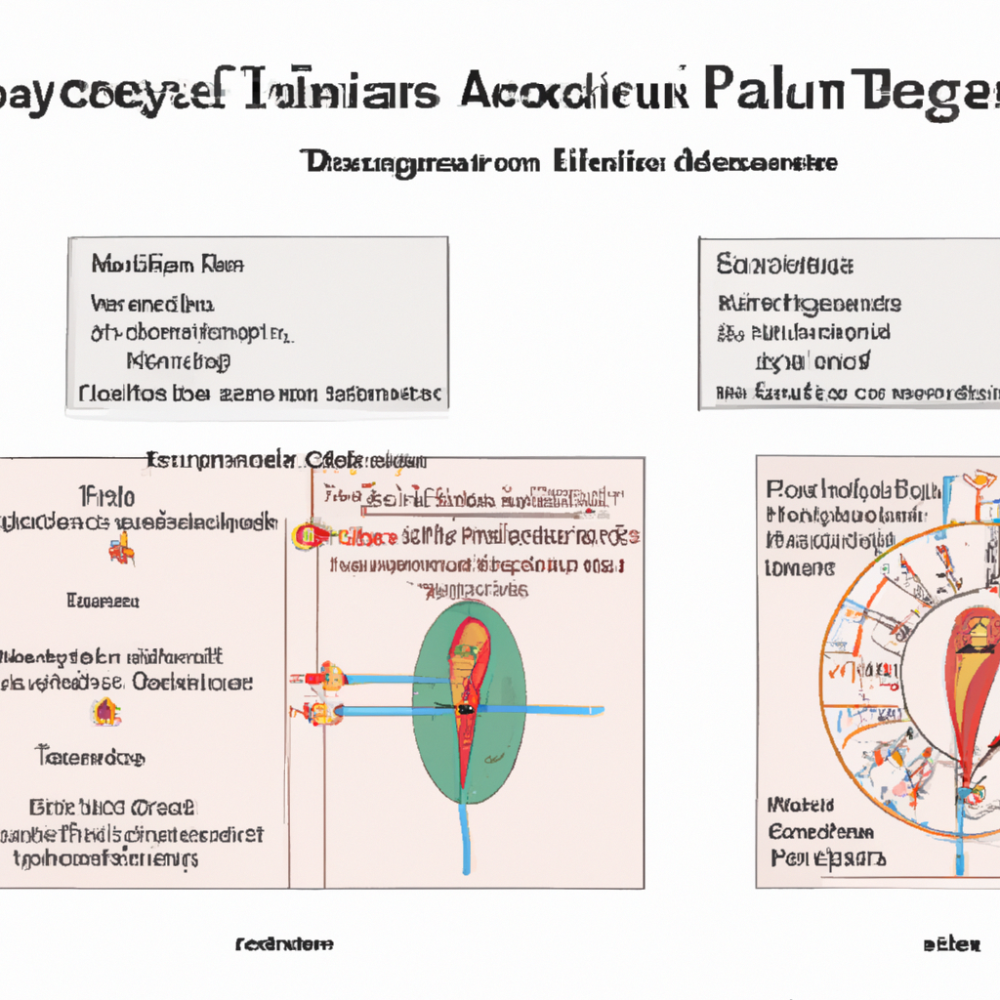

# Improvement of endocrine and metabolic conditions in patients with polycystic ovary syndrome through acupuncture and its combined therapies: a systematic review and meta-analysis.

**Yazarlar:** Tianyu Wu, Yiwei Liu, Fanjing Kong, Jinqun Hu, Yu Liu, Jie Yang, Jiao Chen

## 🧬 Özet (Makale)
Polycystic Ovary Syndrome (PCOS) is a common endocrine disorder among women of reproductive age that significantly impacts their reproductive health. Acupuncture and its combined therapies may have beneficial effects on the endocrine and metabolic states of women with PCOS. This systematic review and meta-analysis evaluated the treatment effects and potential mechanisms of acupuncture and its combined therapies compared to oral metformin in treating PCOS patients.

## ✨ GPT Destekli Özet
**Türkçe:**

Polikistik Over Sendromu (PCOS), üreme çağındaki kadınlarda yaygın bir endokrin bozukluğudur ve bu kadınların üreme sağlığını önemli ölçüde etkiler. Akupunktur ve beraber kullanılan terapiler, PCOS'lu kadınların endokrin ve metabolik durumları üzerinde faydalı etkileri olabilir. Bu sistematik inceleme ve meta-analiz, akupunktur ve beraber uygulanan terapilerin ağızdan alınan metformin ile karşılaştırıldığında PCOS hastalarının tedavisindeki etkilerini ve olası mekanizmalarını değerlendirdi.

**English:**

Polycystic Ovary Syndrome (PCOS) is a prevalent endocrine disorder among women of reproductive age significantly affecting their reproductive health. Acupuncture along with its combined therapies may have beneficial impacts on the endocrine and metabolic states of women with PCOS. This systematic review and meta-analysis examined the treatment effects and possible mechanisms of acupuncture and its combined therapies compared with oral metformin in treating PCOS patients.

## 🧠 Bilimsel Yorum
**Türkçe:**

Türkçe Yorum:

Polikistik Over Sendromu (PCOS), üreme çağındaki kadınlarda sıkça görülen bir endokrin bozukluğudur ve kadınların üreme sağlığını önemli ölçüde etkiler. Geleneksel Çin Tıbbı'nda (TCM), PCOS'nin tedavisinde, özellikle akupunktur, oldukça yaygın bir yaklaşımdır. Bu çalışma, akupunkturun ve bu ile birleştirilmiş terapilerin, ağız yoluyla alınan metformin ile karşılaştırıldığında PCOS hastalarında tedavi etkilerini ve potansiyel mekanizmalarını değerlendirmiştir. Bilimsel olarak, bu çalışma TCM'nin bu tür koşulların tedavisindeki potansiyelini ve akupunkturun hormonal ve metabolik durumları iyileştirme kabiliyetini vurgulamaktadır. Ancak metodolojik olarak, çalışmanın randomize kontrollü çalışmalar üzerine yapılan bir meta-analiz olması nedeniyle, belirli bir yanlılık riskini dikkate almak gereklidir.

İngilizce Yorum:

Polycystic Ovary Syndrome (PCOS) is a common endocrine disorder in women of reproductive age, significantly affecting their reproductive health. Traditional Chinese Medicine (TCM), particularly acupuncture, is quite a prevalent approach in treating PCOS. This study evaluated the treatment effects and potential mechanisms of acupuncture and combined therapies compared with oral metformin in PCOS patients. Scientifically, this study highlights the potential of TCM in treating such conditions and the ability of acupuncture to improve hormonal and metabolic states. Methodologically, however, given that the study is a meta-analysis based on randomized controlled trials, the risk of specific bias should be considered.

**English:**

## 🖼️ İlgili Görsel

## 🔗 Kaynak
[PubMed'de Görüntüle](https://pubmed.ncbi.nlm.nih.gov/40091529/)

## 🗂️ Kategoriler
`Bilimsel Araştırmalar`, `Hastalık Bazlı Uygulamalar`, `Mekanizma & Teori`, `İstatistik & Tablolar`

