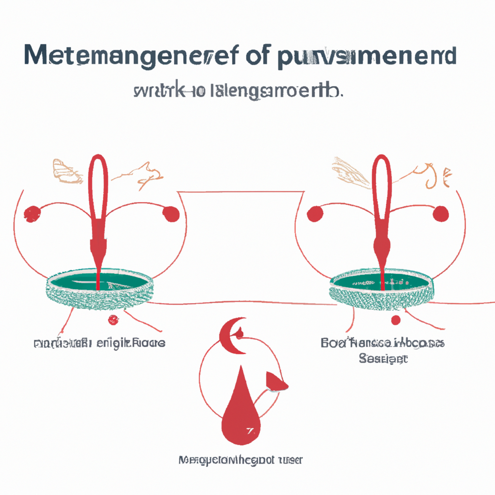

# Mechanistic approach and therapeutic strategies in menstrual and non-menstrual migraine.

**Yazarlar:** Tanya Mani, Munira Murtaza, Rukaiah Fatma Begum, H Gayathri, M Sumithra

## 🧬 Özet (Makale)
Migraine is a common condition that can cause intense headaches, often on one side of the head, along with symptoms like nausea and sensitivity to light and sound. These headaches can be triggered by various factors, including stress, changes in hormones, sleep disturbances, diet, and even gut health. Migraines are more frequent in women, particularly those under 45, and this may be linked to hormones. After age 45, this difference between men and women becomes less noticeable. Women tend to experience migraines that are more severe and last longer than men, with menstrual migraines affecting about 22% of women during nearly half of their menstrual cycles, and 7.6% of women with migraines. Treatments for migraines include medications, lifestyle changes, and alternative therapies, all of which aim to address the different ways migraines can affect people. This review explores these aspects in detail.

## ✨ GPT Destekli Özet
**Türkçe:**

Migren, genellikle başın bir tarafında yoğun baş ağrılarına, mide bulandırıcılığa ve ışığa ve sese duyarlılığa neden olan yaygın bir durumdur. Bu ağrılar, stres, hormonal değişiklikler, uyku bozuklukları, diyet ve hatta bağırsak sağlığı gibi çeşitli faktörler tarafından tetiklenebilir. Migrenler kadınlarda daha yaygındır, özellikle 45 yaşın altındaki kadınlarda, ve bu hormonal nedenlere bağlanabilir. 45 yaşından sonra bu cinsiyetler arasındaki fark azalır. Kadınlar genellikle erkeklerden daha şiddetli ve daha uzun süren migrenler yaşar, menstrual migrenler ise kadınların yaklaşık %22'sini, adet döngülerinin neredeyse yarısında etkiler ve migreni olan kadınların %7.6'sını etkiler. Migrenler için tedaviler arasında ilaçlar, yaşam tarzı değişiklikleri ve alternatif terapiler yer alır, tüm bu tedaviler migrenin insanları farklı şekillerde nasıl etkileyebileceğini ele almayı amaçlar. Bu inceleme bu yönleri ayrıntılı olarak inceler.

**English:**

Migraine is a prevalent condition causing intense headaches often on one side of the head, along with symptoms such as nausea and sensitivity to light and sound. These headaches can be provoked by a range of factors including stress, hormonal alterations, sleep disturbances, diet, and even gut health. Migraines are more frequent in women, especially those under 45, potentially tied to hormones. Post 45 years, this gender distinction becomes less noticeable. Women tend to suffer from migraines that are more severe and longer-lasting than men, with menstrual migraines affecting approximately 22% of women during nearly half of their menstrual cycles, and 7.6% of women with migraines. Treatments for migraines encompass medications, lifestyle changes, and alternative therapies, all aiming to address the various ways migraines can impact individuals. This review delves into these aspects in detail.

## 🧠 Bilimsel Yorum
**Türkçe:**

Türkçe Yorum: Geleneksel Çin Tıbbı (GCT) bağlamında, migrenin sinir, kan ve enerji (Qi) dengesizliği sonucu oluştuğu kabul edilir. Bu dengesizlik aynı zamanda hormonal değişikliklere, stres ve yaşam tarzı faktörlerine de bağlı olabilir. GCT'nin özellikle akupunktur uygulaması, bu dengesizlikleri düzelterek migren semptomlarını hafifletebilir. Ayrıca, GCT hormon dengesizliklerini de düzenleyebilir, bu da adet dönemi migrenlerinin tedavisinde önemli olabilir. Ancak, bu yaklaşımın bilimsel geçerliliği konusunda daha fazla araştırma yapılması gerekmektedir. Bugüne kadar yapılan çalışmalarda, metodolojik sınırlamalar ve standartların olmaması, GCT'nin migren tedavisindeki etkinliğini belirlemeyi zorlaştırmıştır. Klinikte, bireysel sağlık durumu, yaşam tarzı ve diğer faktörler göz önünde bulundurulduğunda GCT'nin potansiyel faydaları olabilir.

English Comment: From a Traditional Chinese Medicine (TCM) perspective, migraines are considered to be a result of imbalances in nerves, blood and energy (Qi). These imbalances can be interconnected with hormonal changes, stress, and lifestyle factors. Especially the practice of acupuncture in TCM may alleviate migraine symptoms by addressing these imbalances. Furthermore, TCM may also help regulate hormonal imbalances, which could be significant in treating menstrual migraines. However, there is a need for further research to validate the scientific legitimacy of this approach. To date, the methodological limitations and lack of standards in the studies have made it challenging to determine the effectiveness of TCM in treating migraines. In clinical practice, there could be potential benefits of TCM when individual health status, lifestyle, and other factors are considered.

**English:**

## 🖼️ İlgili Görsel

## 🔗 Kaynak
[PubMed'de Görüntüle](https://pubmed.ncbi.nlm.nih.gov/40040266/)

## 🗂️ Kategoriler
`Bilimsel Araştırmalar`, `Mekanizma & Teori`, `Hastalık Bazlı Uygulamalar`

