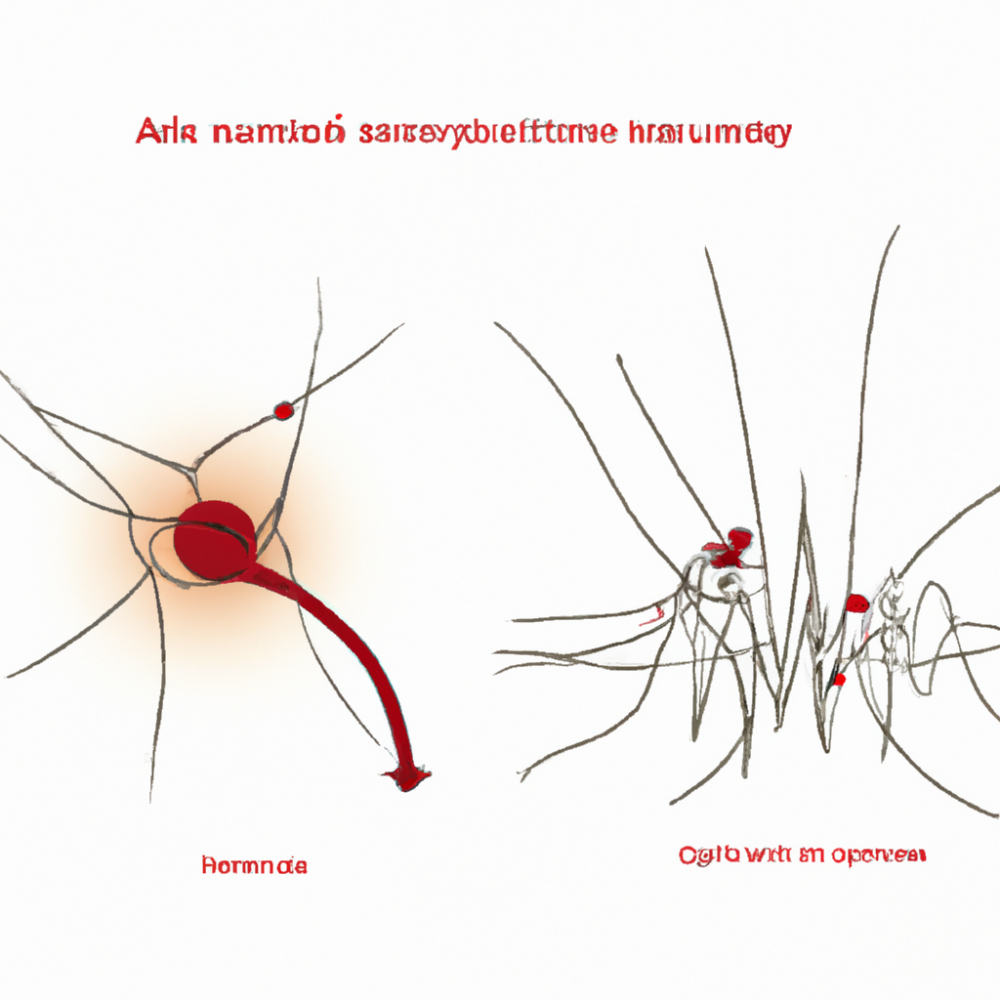

# The potential associations between acupuncture sensation and brain functional network: a EEG study.

**Yazarlar:** Dongyang Shen, Banghua Yang, Jing Li, Jiayang Zhang, Yongcong Li, Guofu Zhang, Yanyan Zheng

## 🧬 Özet (Makale)
Acupuncture has been widely used as an effective treatment for post-stroke rehabilitation. However, the potential association between acupuncture sensation, an important factor influencing treatment efficacy, and brain functional network is unclear. This research sought to reveal and quantify the changes in brain functional network associated with acupuncture sensation. So multi-channel EEG signals were collected from 30 healthy participants and the Massachusetts General Hospital Acupuncture Sensation Scale (MASS) was utilized to assess their needling sensations. Phase Lag Index (PLI) was used to construct the brain functional network, which was analyzed with graph theoretic methods. It showed that in the needle insertion (NI) state the MASS Index was significantly higher than in the needle retention (NR) state (

## ✨ GPT Destekli Özet
**Türkçe:**

Akupunktur, felç sonrası rehabilitasyon için etkili bir tedavi olarak yaygın şekilde kullanılmaktadır. Ancak, tedavi etkinliğini etkileyen önemli bir faktör olan akupunktur hissi ile beyin fonksiyonel ağı arasındaki potansiyel ilişki belirsizdir. Bu araştırma, akupunktur hissi ile ilişkili beyin fonksiyonel ağındaki değişiklikleri ortaya çıkarmayı ve nicellemeyi amaçlamaktadır. Bu yüzden, 30 sağlıklı katılımcıdan çok kanallı EEG sinyalleri toplandı ve iğneleme hislerini değerlendirmek için Massachusetts Genel Hastanesi Akupunktur Hissi Ölçeği (MASS) kullanıldı. Faz Gecikme İndeksi (PLI) beyin fonksiyonel ağını oluşturmak için kullanıldı ve bu ağ, çizge teorisi yöntemleri ile analiz edildi. İğnenin yerleştirildiği durumda (NI) MASS İndeksi'nin iğnenin tutulduğu duruma (NR) göre anlamlı şekilde yüksek olduğu gösterildi.

**English:**

Acupuncture is commonly used as an effective treatment for post-stroke rehabilitation. However, the potential link between acupuncture sensation, an influential factor in treatment efficacy, and the brain functional network remains unclear. This research aimed to expose and quantify alterations in the brain functional network associated with acupuncture sensation. Therefore, multi-channel EEG signals were gathered from 30 healthy participants and the Massachusetts General Hospital Acupuncture Sensation Scale (MASS) was employed to evaluate their needling sensations. Phase Lag Index (PLI) was utilized to form the brain functional network, which was evaluated with graph theoretic methods. Findings showed that the MASS Index was significantly greater in the needle insertion (NI) state compared to the needle retention (NR) state.

## 🧠 Bilimsel Yorum
**Türkçe:**

Türkçe Yorum:

Geleneksel Çin Tıbbı (GÇT) açısından incelendiğinde, bu çalışma akupunktur uygulamalarının sinir sistemi üzerindeki potansiyel etkilerini analitik bir yaklaşımla inceliyor. Akupunktur uygulamasının incelendiği ve MASS ölçeğiyle iğneleme hissi değerlendirildiği bir çerçevede, belirli bir beyin işlevsel ağı ve akupunktur hissi arasındaki ilişkinin bulunabileceği öne sürülüyor. Bu, GÇT’de ‘Qi’nin akışını teşvik etmek için kullanılan akupunktur noktalarının anatomik olarak nörolojik temellere dayandığına dair teorik varsayımla uyumlu bir sonuçtur.

Bilimsel geçerliliği açısından, kapsamlı bir EEG veri setinin kullanılması ve iğne ekleme (NI) ve iğne tutma (NR) durumları arasında çarpıcı bir farkın saptandığı faktörler metodolojik güce işaret ediyor. Bununla birlikte, çalışmanın zayıf yönleri arasında çok sayıda örneklem gerektiren daha karmaşık bir beyin fonksiyonel ağı analizinin yapılabilmesi için daha çok katılımcıya ihtiyaç duyulması gösterilebilir.

Klinik uygulamadaki potansiyel önemi, daha etkili bir tedavi sağlama potansiyelinde yatmaktadur. Eğer bu bulgular tekrarlanabilir ve doğrulanabilirse, akupunkturla ideal beyin fonksiyonel ağ uyarımının sağlanması ve bunun sonucunda daha üst düzeyde bir iyileşme elde edilmesi için belirli uygulama tekniklerinin seçilebileceğini gösterebilir.

English Comment:

From a Traditional Chinese Medicine (TCM) perspective, this study analytically explores the potential impacts of acupuncture practices on the nervous system. In a framework where acupuncture application is examined and needle sensation is evaluated with the MASS scale, it is suggested that a particular brain functional network and acupuncture sensation might be interrelated. This finding is consistent with the theoretical assumption in TCM that acupuncture points used to stimulate the flow of ‘Qi’ are anatomically based on neurological foundations. 

Regarding scientific validity, the use of a comprehensive EEG dataset and the striking difference found between needle insertion (NI) and needle retention (NR) states indicate methodological strength. However, among the weaknesses of the study could be the need for more participants to conduct a more complex brain functional network analysis, which requires a larger sample size.

The potential significance in clinical application lies in the potential to provide more effective treatment. If these findings can be replicated and validated, it could suggest the option of selecting specific application techniques for optimum stimulation of the brain functional network with acupuncture, leading to superior recovery.

**English:**

## 🖼️ İlgili Görsel

## 🔗 Kaynak
[PubMed'de Görüntüle](https://pubmed.ncbi.nlm.nih.gov/40099217/)

## 🗂️ Kategoriler
`Bilimsel Araştırmalar`, `Mekanizma & Teori`, `Teknikler`

