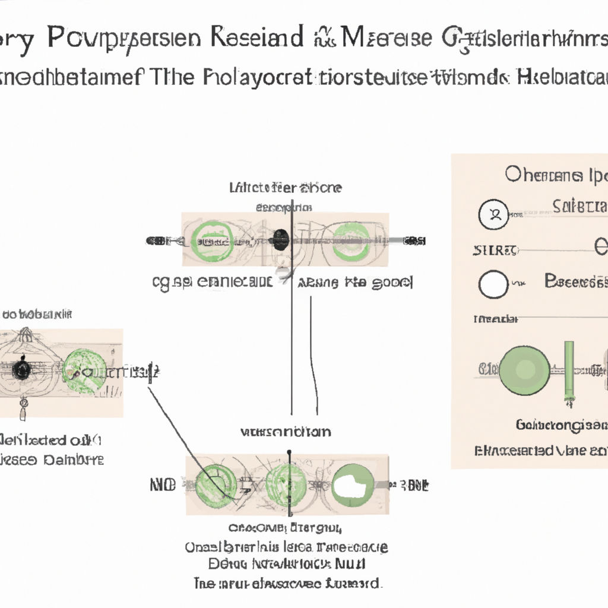

# Improvement of endocrine and metabolic conditions in patients with polycystic ovary syndrome through acupuncture and its combined therapies: a systematic review and meta-analysis.

**Yazarlar:** Tianyu Wu, Yiwei Liu, Fanjing Kong, Jinqun Hu, Yu Liu, Jie Yang, Jiao Chen

## 🧬 Özet (Makale)
Polycystic Ovary Syndrome (PCOS) is a common endocrine disorder among women of reproductive age that significantly impacts their reproductive health. Acupuncture and its combined therapies may have beneficial effects on the endocrine and metabolic states of women with PCOS. This systematic review and meta-analysis evaluated the treatment effects and potential mechanisms of acupuncture and its combined therapies compared to oral metformin in treating PCOS patients.

## ✨ GPT Destekli Özet
**Türkçe:**

Polikistik Over Sendromu (PCOS), üreme çağındaki kadınlarda yaygın olarak görülen bir endokrin bozukluğudur ve bu, onların üreme sağlığını ciddi bir şekilde etkiler. Akupunktur ve kombinasyon tedavilerinin, PCOS'lu kadınların endokrin ve metabolik durumları üzerinde faydalı etkileri olabilir. Bu sistematik derleme ve meta-analiz, akupunktur ve kombinasyon tedavilerinin PCOS hastalarını tedavi etmek için oral metformin ile karşılaştırıldığında tedavi etkilerini ve potansiyel mekanizmalarını değerlendirmiştir.

**English:**

Polycystic Ovary Syndrome (PCOS) is a prevalent endocrine disorder among women of reproductive age, significantly affecting their reproductive health. Acupuncture and its combined therapies might have beneficial impacts on the endocrine and metabolic states of women with PCOS. This systematic review and meta-analysis assessed the treatment effects and potential mechanisms of acupuncture and its combined therapies compared to oral metformin in treating PCOS patients.

## 🧠 Bilimsel Yorum
**Türkçe:**

Türkçe Yorum:

Bu çalışma Geleneksel Çin Tıbbı (GTC) açısından büyük bir önem taşır. PCOS'un tedavisi için batı tıbbında yegane çözüm hormonal ilaçlar ve yaşam tarzı değişiklikleridir. Ancak bu çalışma, akupunktur ve ek tedavilerin bu hastalığın tedavisinde potansiyel bir seçenek olabileceğini gösterir. Geleneksel Çin Tıbbı'nda, akupunktur, bedenin enerjisinin (Qi) akışını dengeleyerek sağlığı iyileştirir. Bu enerji akışının düzenlenmesi, hormonal dengesizlikleri düzeltebilir ve PCOS belirtilerini hafifletebilir.

Bilimsel geçerliliği açısından, bu çalışma, akupunkturun potansiyel etkilerini gösteren bir dizi klinik denemenin gözden geçirilmesidir. Ancak bulguların genellenmesi konusunda dikkatli olunmalıdır çünkü kontrol altına alınması gereken birçok değişken vardır. Bu çalışmada yöntemsel bir zayıflık, kıyaslama tedavisi olarak kullanılan oral metformin'in, PCOS'un kompleksliğine ve etkilenen kısımlara tam olarak hitap etmeyebileceğidir.

Sonuç olarak, bu çalışma Geleneksel Çin Tıbbı'nın modern tıp uygulamalarına entegrasyonu ve bunun potansiyel faydaları konusunda önemli bilgiler sağlar. Ancak, daha kapsamlı ve geniş çaplı araştırmalar gerekmektedir.

English Comment:

This study bears significant importance from the perspective of Traditional Chinese Medicine (TCM). The primary solution for PCOS treatment in western medicine lies in hormonal drugs and lifestyle modifications. However, this study exhibits that acupuncture and adjunct therapies could be a potential option for treating this condition. In TCM, acupuncture improves health by balancing the body's energy (Qi) flow. Such regulation of energy flow could rectify hormonal imbalances and alleviate PCOS symptoms.

Regarding scientific validity, this study is a review of a series of clinical trials demonstrating potential effects of acupuncture. However, caution should be taken in generalizing the findings as there are numerous variables to control. A methodological weakness in this study is that the oral metformin used as a comparator therapy may not fully address the complexity and areas affected by PCOS.

In conclusion, this study provides significant insights into the integration of Traditional Chinese Medicine into modern medical practices and its potential benefits. However, more comprehensive and large-scale research is necessary.

**English:**

## 🖼️ İlgili Görsel

## 🔗 Kaynak
[PubMed'de Görüntüle](https://pubmed.ncbi.nlm.nih.gov/40091529/)

## 🗂️ Kategoriler
`Bilimsel Araştırmalar`, `Mekanizma & Teori`, `Hastalık Bazlı Uygulamalar`, `İstatistik & Tablolar`

