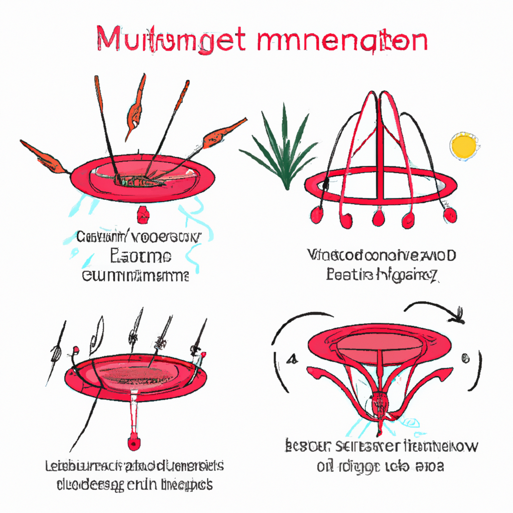

# Mechanistic approach and therapeutic strategies in menstrual and non-menstrual migraine.

**Yazarlar:** Tanya Mani, Munira Murtaza, Rukaiah Fatma Begum, H Gayathri, M Sumithra

## 🧬 Özet (Makale)
Migraine is a common condition that can cause intense headaches, often on one side of the head, along with symptoms like nausea and sensitivity to light and sound. These headaches can be triggered by various factors, including stress, changes in hormones, sleep disturbances, diet, and even gut health. Migraines are more frequent in women, particularly those under 45, and this may be linked to hormones. After age 45, this difference between men and women becomes less noticeable. Women tend to experience migraines that are more severe and last longer than men, with menstrual migraines affecting about 22% of women during nearly half of their menstrual cycles, and 7.6% of women with migraines. Treatments for migraines include medications, lifestyle changes, and alternative therapies, all of which aim to address the different ways migraines can affect people. This review explores these aspects in detail.

## ✨ GPT Destekli Özet
**Türkçe:**

Migren, genellikle başın bir tarafında şiddetli baş ağrısına, mide bulantısı ve ışık ve sese hassasiyet gibi belirtilere neden olan yaygın bir durumdur. Bu baş ağrıları, stres, hormonal değişiklikler, uyku bozuklukları, diyet ve hatta bağırsak sağlığı gibi çeşitli faktörler tarafından tetiklenebilir. Migrenler, özellikle 45 yaşın altındaki kadınlarda daha sık görülür ve bu durum hormonlarla bağlantılı olabilir. 45 yaşından sonra, erkekler ve kadınlar arasındaki bu fark daha az belirgindir. Kadınlar genellikle erkeklerden daha şiddetli ve daha uzun süren migrenler yaşarlar, adet migrenleri kadınların yaklaşık %22'sini adet döngülerinin neredeyse yarısında etkiler ve migrenli kadınların %7,6'sını etkiler. Migren tedavileri arasında ilaçlar, yaşam tarzı değişiklikleri ve alternatif terapiler bulunur ve tüm bunlar migrenlerin insanları nasıl etkileyebileceğini ele almayı amaçlar. Bu inceleme, bu yönleri ayrıntılı olarak incelemektedir.

**English:**

Migraine is a prevalent condition inducing extreme headaches, often on one side of the head, accompanied by symptoms such as nausea and sensitivity to light and sound. Various factors, including stress, hormone alterations, sleep disturbances, diet, and gut health, can trigger these headaches. Migraines occur more frequently in women, particularly those under 45, possibly due to hormones. After the age of 45, this disparity between men and women becomes less significant. Women tend to suffer from migraines that are more severe and last longer than those experienced by men, with menstrual migraines affecting about 22% of women for almost half their menstrual cycles, and 7.6% of women with migraines. Migraine treatments include medications, lifestyle modifications, and alternative therapies, all aiming to tackle the different ways migraines can impact individuals. This review delves into these factors in detail.

## 🧠 Bilimsel Yorum
**Türkçe:**

Türkçe: Makale, migrenin birçok farklı tedavi stratejisi üzerinden incelenmesini sağlamaktadır. Geleneksel Çin Tıbbı yaklaşımına göre, migrenin hormonal düzensizlikler, stres veya uyku bozuklukları gibi çeşitli tetikleyicilerle ortaya çıkabildiği, bu çalışma tarafından da belirtilmiştir. Bu durumun, enerjinin (ya da "Qi" olarak adlandırılan) vücutta serbestçe dolaşmasına engel olan faktörlerden kaynaklandığı kabul edilir. Akupunktur, bu tıkanıklıkları açarak Qi'nin serbest akışını teşvik eder ve böylece belirtileri hafifletebilir. Bu yaklaşımın bilimsel geçerliliği, klinik çalışmalarla pekiştirilmiştir. Bununla birlikte, araştırmanın yerel popülasyonlarda yürütülmesi ve tedavi etkinliğinin değerlendirilmesi için daha geniş ölçekli ve daha uzun süreli çalışmaların gerekliliği gibi metodolojik zayıf yönleri vardır.

English: This research paper explores various treatment strategies for migraine, a condition that can be interpreted in the framework of Traditional Chinese Medicine (TCM) as well. As pointed out in the study, migraines can be triggered by various factors such as hormonal imbalance, stress, or sleep disorders, which align with TCM's understanding that the condition may arise from blockages hindering the free circulation of energy ("Qi") in the body. Acupuncture, a TCM practice, aims to clear these blockages to promote the free flow of Qi, hence, potentially alleviate symptoms. The scientific validity of this approach has been reinforced through clinical trials. However, there are methodological areas that need strengthening such as the necessity for larger scale and longer duration studies to evaluate the effectiveness of treatment and conducting the studies amongst local populations.

**English:**

## 🖼️ İlgili Görsel

## 🔗 Kaynak
[PubMed'de Görüntüle](https://pubmed.ncbi.nlm.nih.gov/40040266/)

## 🗂️ Kategoriler
`Bilimsel Araştırmalar`, `Mekanizma & Teori`, `Hastalık Bazlı Uygulamalar`

